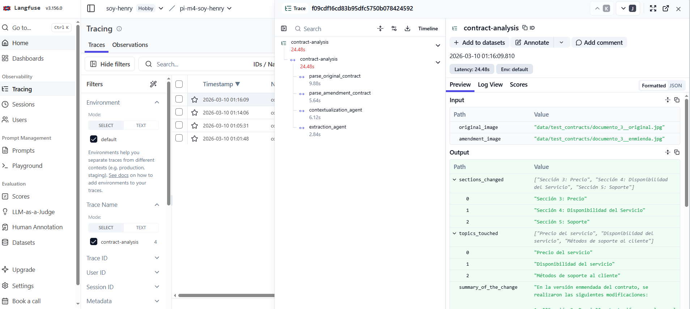

# Resolución PI para el módulo 4

## 0) Ambiente virtual
```
python3 -m venv .venv
source .venv/bin/activate
```

Para la instalación de dependencias:
```
pip3 install -r requirements.txt
```

Recordar definir las credenciales de OpenAI API y Langfuse.

## 1) Casos de Uso

### Caso 1: Contrato de Licencia de Software
```
python3 src/main.py \
--original data/test_contracts/documento_1__original.jpg \
--amendment data/test_contracts/documento_1__enmienda.jpg
```

Output:
```
{
  "sections_changed": [
    "Otorgamiento de Licencia",
    "Plazo",
    "Pago",
    "Soporte",
    "Terminación"
  ],
  "topics_touched": [
    "Licencia de uso",
    "Duración del contrato",
    "Tarifas de licencia",
    "Soporte técnico",
    "Terminación del contrato",
    "Protección de datos"
  ],
  "summary_of_the_change": "La enmienda al contrato de licencia de software introduce varios cambios significativos. En la sección de 'Otorgamiento de Licencia', se elimina la restricción de 'intransferible' y se especifica que la licencia es para 'operaciones internas de negocio'. El 'Plazo' del contrato se extiende de 12 a 24 meses. La 'tarifa anual de licencia' aumenta de USD 12.000 a USD 15.000. En cuanto al 'Soporte', se añade la opción de soporte técnico vía chat además del correo electrónico. La 'Terminación' del contrato ahora requiere un aviso de 60 días en lugar de 30. Además, se agrega una nueva sección sobre 'Protección de Datos', comprometiendo al Licenciante a cumplir con las normativas aplicables en esta materia."
}
```

### Caso 2: Contrato de Servicios de Consultoría
```
python3 src/main.py \
--original data/test_contracts/documento_2__original.jpg \
--amendment data/test_contracts/documento_2__enmienda.jpg
```

Output:
```
{
  "sections_changed": [
    "Alcance del Servicio",
    "Duración",
    "Honorarios",
    "Entregables"
  ],
  "topics_touched": [
    "Consultoría estratégica",
    "Análisis regulatorio",
    "Duración del contrato",
    "Honorarios",
    "Frecuencia de entregables",
    "Propiedad intelectual"
  ],
  "summary_of_the_change": "La enmienda al contrato introduce varias modificaciones significativas: \n\n1. **Alcance del Servicio:** Se amplía para incluir no solo la consultoría estratégica para la expansión de proyectos de energía renovable, sino también el análisis regulatorio.\n\n2. **Duración:** Se extiende el período de prestación de servicios de 6 a 9 meses.\n\n3. **Honorarios:** Se incrementa la tarifa mensual de USD 8,000 a USD 9,500.\n\n4. **Entregables:** Se modifica la frecuencia de los reportes de avance de mensuales a quincenales.\n\nAdemás, se agrega una nueva sección sobre **Propiedad Intelectual**, que establece que todos los entregables serán propiedad del Cliente una vez realizado el pago final. Esta sección no estaba presente en el contrato original."
}
```

### Caso 3: Contrato SaaS
```
python3 src/main.py \
--original data/test_contracts/documento_3__original.jpg \
--amendment data/test_contracts/documento_3__enmienda.jpg
```

Output:
```
{
  "sections_changed": [
    "Sección 3: Precio",
    "Sección 4: Disponibilidad del Servicio",
    "Sección 5: Soporte"
  ],
  "topics_touched": [
    "Precio del servicio",
    "Disponibilidad del servicio",
    "Métodos de soporte al cliente"
  ],
  "summary_of_the_change": "En la versión enmendada del contrato, se realizaron las siguientes modificaciones: \n\n1. **Sección 3: Precio** - La tarifa mensual que el Cliente debe pagar por el servicio aumentó de USD 1.200 a USD 1.250.\n\n2. **Sección 4: Disponibilidad del Servicio** - El porcentaje de disponibilidad garantizada del servicio se incrementó de 99,5% a 99,9%.\n\n3. **Sección 5: Soporte** - Se añadió un nuevo método de soporte al cliente, pasando de solo correo electrónico a incluir también un sistema de tickets en línea."
}
```

## 2) Trazabilidad

Implementación final en Langfuse

